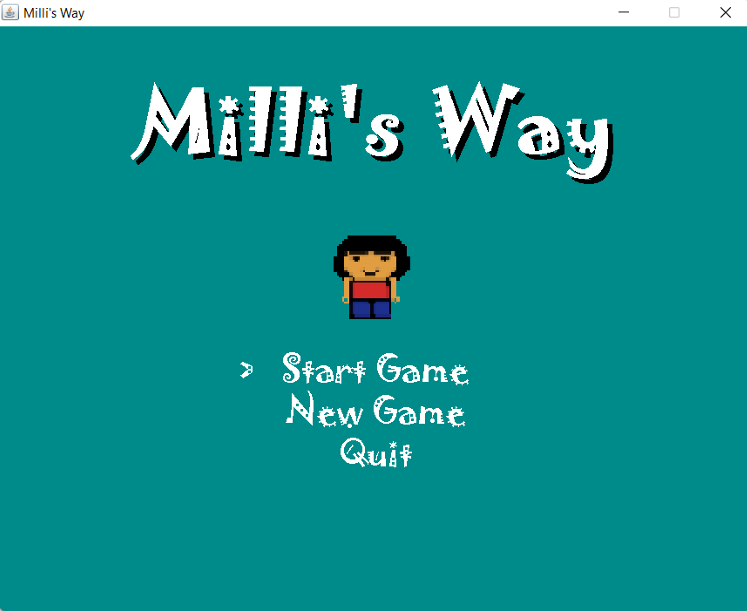
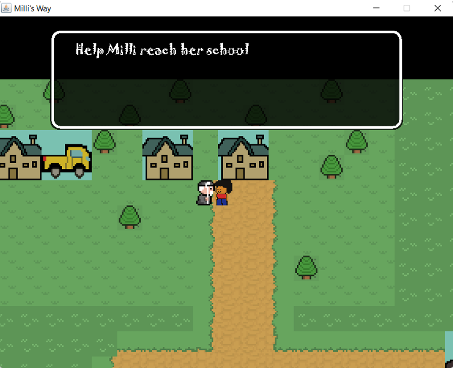
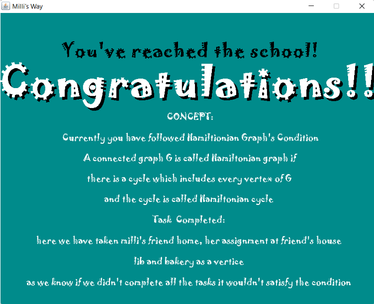

# Milli's Way - a graph theory game

### Technology badges

Java 2D educational game that teaches the Hamiltonian graph concept through navigation, key collection, task completion, and a journey to school.

## Technologies

- Java
- Java Swing and AWT
- Java 2D graphics
- Object-oriented programming
- Keyboard event handling
- Tile-based map rendering
- Collision detection
- Java Sound API

## Gameplay

The player controls Milli as she travels through locations represented as vertices in the game world. She must complete the required tasks and collect four keys before reaching the final destination. The completion screen connects the route taken during the game with the definition of a Hamiltonian graph and Hamiltonian cycle.

## Features

- Tile-based 2D world
- Keyboard-controlled player movement
- Collision detection for map tiles, objects, and NPCs
- Four collectible keys
- NPC dialogue and gameplay guidance
- Task-completion condition before the game can finish
- Title, gameplay, pause, dialogue, and completion states
- Sound effects and background music support
- Final educational explanation of the Hamiltonian graph concept

## Controls

| Key | Action |
| --- | --- |
| Arrow keys | Move Milli or navigate menu options |
| Enter | Select a menu option or continue dialogue |
| P | Pause or resume the game |
| T | Toggle the draw-time debugging display |

## How the Game Was Built

1. Selected the Hamiltonian graph concept as the educational foundation of the game.
2. Designed a map in which Milli travels through task locations before reaching school.
3. Created a game panel with a timed update-and-render loop.
4. Implemented keyboard movement, sprite rendering, and world-to-screen positioning.
5. Added collision checking for tiles, objects, and NPCs.
6. Placed keys and other game objects at defined coordinates in the map.
7. Created dialogue, pause, title, and completion states.
8. Connected completion of the required tasks to an explanation of the Hamiltonian graph concept.

## What I Learned

- How graph theory can be presented through interactive gameplay
- How to organize a Java game into `main`, `entity`, `object`, and `tile` packages
- How to create and manage a continuous game loop
- How to implement movement and collision detection in a tile-based world
- How to load maps, sprites, objects, NPCs, and audio as resources
- How to track collectibles and use them as a completion condition
- How to manage multiple game states and on-screen messages

## Possible Improvements

- Display the player's completed route as a graph after the game
- Add multiple graph-theory levels and compare Hamiltonian and non-Hamiltonian routes
- Add a working quiz section; the supplied code contains an unfinished/commented quiz design
- Add accessibility options for text size, sound, and keyboard controls

## Preview

### Milli's Way title screen

---

### Milli speaking with an NPC

### Hamiltonian graph completion screen

## Contributors

- Mansiba Gohil
- Nidhi Dhinoja
- Prof. Foram Chandarana - project guidance
